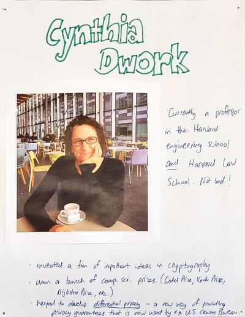
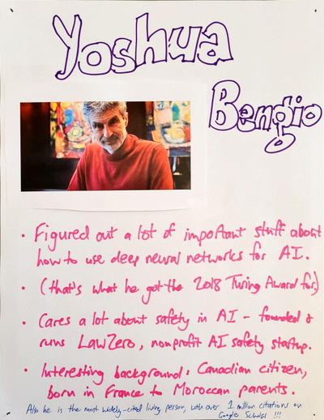

  

    <a href="assets/images/dwork-oct-2025.jpg" target="_blank" title="Click to view full size">
      
      Open Full Page
    </a>
  

  

    <a href="assets/images/bengio-jan2026.jpg" target="_blank" title="Click to view full size">
      
      Open Full Page
    </a>
  

